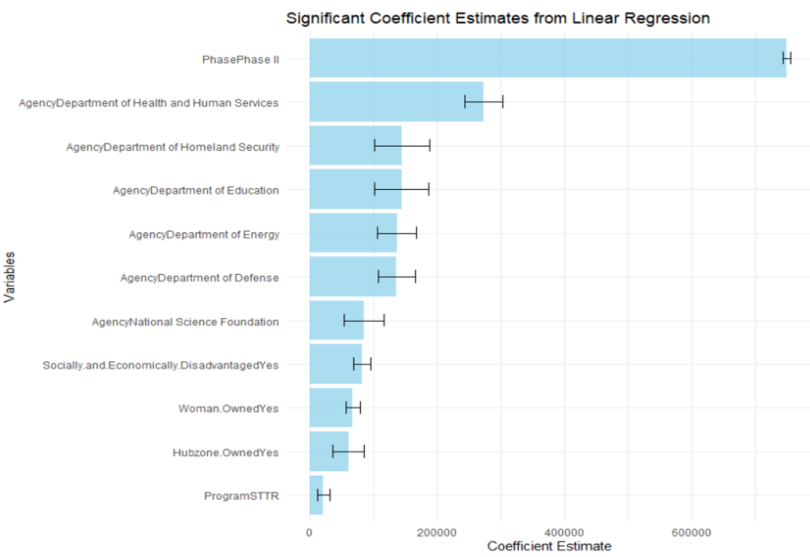
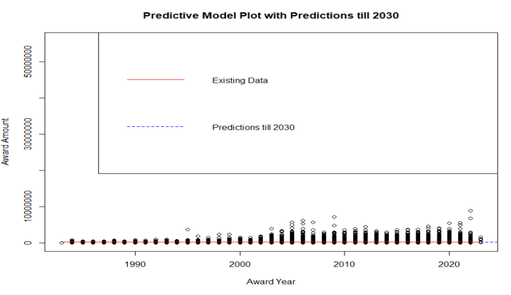

# **Company Award Data Analysis**

## **📌 Project Overview**
This project explores **Small Business Innovation Research (SBIR) and Small Business Technology Transfer (STTR) funding**, analyzing patterns in **grant distribution, agency contributions, and company characteristics**. The study investigates key research questions related to **funding amounts, geographical differences, and predictive modeling**.

## **📂 Dataset Information**
- **Total Records:** 33,708 observations  
- **Variables:** 39 columns containing company details, award amounts, agency classifications, and other key attributes.  

### **📊 Key Variables**
| Variable | Description |
|----------|------------|
| `Award.Amount` | Funding amount granted to the company |
| `Agency` | Funding agency name |
| `Program` | Program classification (SBIR/STTR) |
| `Phase` | Project phase (Phase I or Phase II) |
| `Company` | Name of the company awarded funding |
| `State` | Location of the company (e.g., NC, AL) |
| `Hubzone.Owned` | Whether the company is in a designated HubZone (Yes/No) |
| `Socially.and.Economically.Disadvantaged` | Social disadvantage status (Yes/No) |
| `Woman.Owned` | Woman-owned business indicator (Yes/No) |

---

## **📈 Exploratory Data Analysis**
The analysis covers various **statistical and visual insights** to explore funding trends and company characteristics.

### **📉 Data Cleaning & Outlier Detection**
- **Removed outliers** using **Z-scores** for award amounts.
- **Converted categorical variables** into factors for analysis.
- **Dropped high-missing-value columns** to improve data integrity.
- #### **📉 Missing Values Analysis**

### **📊 Funding Trends Over Time**
- **What was the distribution of grants from 1984 to 2022?**
- **Which agencies contributed the most in North Carolina (NC) and Alabama (AL)?**
- **How did funding change over the years?**

#### **📈 Line Chart: Award Trends Over Time**
Shows the changes in award amounts from **1984 to 2022**, highlighting trends in funding distribution.

---

## **📊 Hypothesis Testing**
The project explores multiple research questions using **statistical hypothesis tests**:

### **🧑‍🤝‍🧑 HYPOTHESIS #1: Social Disadvantage & Award Amounts**
- **Question:** Do socially disadvantaged businesses receive higher funding?  
- **Test Used:** **Two-tailed two-sample t-test**  
- **Result:** The p-value (**0.00000258**) is **statistically significant**, meaning **socially disadvantaged businesses receive higher average award amounts**. 

---

### **🌍 HYPOTHESIS #2: Geographical Impact on Funding**
- **Question:** Is there a significant difference between award amounts in NC vs AL in 2023?  
- **Test Used:** **One-tailed two-sample t-test**  
- **Result:** The p-value (**0.0238**) suggests **NC companies received significantly higher funding than AL companies** in 2023.

### **📑 HYPOTHESIS #3: Solicitation Frequency by HHS**
- **Question:** Does the Department of Health and Human Services (HHS) release 200 solicitations per year on average?  
- **Test Used:** **One-sample t-test**  
- **Result:** The p-value (**0.1592**) indicates **no significant difference**, meaning the HHS solicitation rate is close to expectations.

#### **📊 Q-Q Plot for Normality**

---

## **📉 Regression & Predictive Modeling**
- **Can we reliably predict award amounts based on company attributes?**  
- **What factors most influence funding decisions?**

### **📊 Regression Analysis Findings**
- **Weak correlation (R² = 0.05931)** between **Award Year** and **Award Amount**, suggesting limited predictability.
- **Social disadvantage & woman-owned status** have **some correlation**, but overall effects are small.

---

## **🔬 Conclusion & Recommendations**
1. **Socially disadvantaged companies receive significantly higher awards**, suggesting funding prioritization based on diversity factors.
2. **NC received significantly higher funding than AL**, indicating regional disparities in funding allocation.
3. **Predictive modeling showed weak correlations**, meaning **external factors beyond company attributes influence award decisions**.

---

## **🤝 Contributing**
If you’d like to contribute, feel free to share feedback or improvements.

## **📜 License**
This project is licensed under the **MIT License**.

---
🚀 **Explore the company award data trends and insights!**

